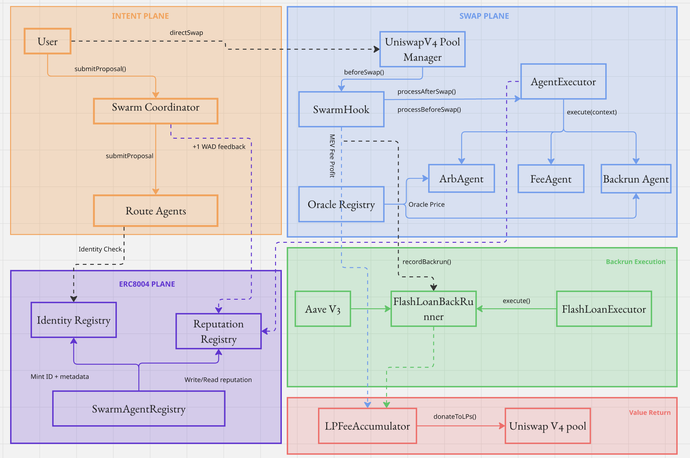

<p align="center">
  <h1 align="center">SwarmRep Protocol</h1>
  <p align="center">
    MEV-Aware Swap Infrastructure on Uniswap v4 · Hook Agents · Flashloan Backruns · ERC-8004 Identity
  </p>
</p>

<p align="center">
  <a href="docs/ARCHITECTURE.md">Architecture</a> ·
  <a href="docs/ANVIL_SEPOLIA_E2E.md">Local E2E Guide</a> ·
  <a href="docs/FRONTEND_E2E_GUIDE.md">Frontend Testing</a> ·
  <a href="docs/SEPOLIA_DEPLOYMENT.md">Sepolia Deployment</a>
</p>

---


## What Is SwarmRep?


SwarmRep is a protocol that makes swaps safer and fairer by reducing MEV extraction and redistributing captured value back to liquidity providers. Instead of letting outside bots take most of the value created around large swaps, SwarmRep keeps protection and value routing inside the protocol itself. It is built on top of Uniswap v4 and continuously watches swap conditions so users get a more protected trading experience while LPs benefit from value that would normally leak out.

SwarmRep also introduces an agent-based execution model where specialized on-chain agents handle routing and market-response tasks, and **ERC-8004** is used to give those agents verifiable identity and reputation. That means automation is not a black box: agents are registered, trackable, and accountable on-chain. The end result is a transparent system that aligns users, LPs, and executors by combining MEV-aware execution, value redistribution, and auditable agent performance in one protocol.

---

## Architecture

<p align="center">
  
</p>


## Contracts

| Contract | Path | Purpose |
|----------|------|---------|
| **SwarmHook** | `src/hooks/SwarmHook.sol` | Uniswap v4 hook — delegates to agents, applies MEV accounting, accumulates LP value |
| **AgentExecutor** | `src/agents/AgentExecutor.sol` | Agent manager — stores/switches agents per type, supports backup failover + ERC-8004 scoring |
| **ArbitrageAgent** | `src/agents/ArbitrageAgent.sol` | Compares pool price vs oracle, recommends pre-swap value capture |
| **DynamicFeeAgent** | `src/agents/DynamicFeeAgent.sol` | Recommends dynamic fee override based on volatility/divergence |
| **BackrunAgent** | `src/agents/BackrunAgent.sol` | Detects post-swap price dislocations, signals backrun recording |
| **FlashLoanBackrunner** | `src/backrun/FlashLoanBackrunner.sol` | Stores opportunities, executes backruns (capital or Aave flashloan), splits profit 80/20 |
| **FlashBackrunExecutorAgent** | `src/agents/FlashBackrunExecutorAgent.sol` | Permissionless executor — any caller triggers backrun and receives bounty |
| **LPFeeAccumulator** | `src/LPFeeAccumulator.sol` | Accumulates captured MEV value, donates to LPs via Uniswap v4 `donate()` |
| **SwarmCoordinator** | `src/SwarmCoordinator.sol` | Intent router — create/propose/execute swaps with optional ERC-8004 gating |
| **SimpleRouteAgent** | `src/erc8004/SimpleRouteAgent.sol` | Minimal on-chain route agent for intent proposals |
| **SwarmAgentRegistry** | `src/erc8004/SwarmAgentRegistry.sol` | Mints and links ERC-8004 identities for agent contracts |
| **OracleRegistry** | `src/oracles/OracleRegistry.sol` | Maps token pairs to Chainlink feeds, exposes `getLatestPrice()` |

---

## ERC-8004 Integration

[ERC-8004 (Trustless Agents)](lib/erc-8004-contracts/ERC8004SPEC.md) provides the identity and reputation layer:

- **Identity** — Each hook agent and route agent can be linked to an ERC-8004 identity (ERC-721 NFT with agent metadata).
- **Reputation** — The coordinator writes `+1 WAD` feedback for winning route agents on successful execution. `AgentExecutor` can write feedback for hook agents during swaps.
- **Gating** — The coordinator can enforce minimum reputation thresholds for route agent proposals.
- **Switching** — Admin can configure reputation-based agent switching in `AgentExecutor` (always off-path, never inside swaps).

---

## Live Sepolia Deployment

Deployed via `script/DeploySwarmProtocol.s.sol` on Ethereum Sepolia (`chainId=11155111`):

| Contract | Address |
|----------|---------|
| Deployer / Treasury | [`0x28ea4eF61ac4cca3ed6a64dBb5b2D4be1aDC9814`](https://sepolia.etherscan.io/address/0x28ea4eF61ac4cca3ed6a64dBb5b2D4be1aDC9814) |
| PoolManager | [`0x8C4BcBE6b9eF47855f97E675296FA3F6fafa5F1A`](https://sepolia.etherscan.io/address/0x8C4BcBE6b9eF47855f97E675296FA3F6fafa5F1A) |
| SwarmHook | [`0x653557bE812E70CD5B9Abc0f4Ee8f5f4604e00cc`](https://sepolia.etherscan.io/address/0x653557bE812E70CD5B9Abc0f4Ee8f5f4604e00cc) |
| SwarmCoordinator | [`0x5be7B30051264fECf6a248551bd408b98eCfd5d2`](https://sepolia.etherscan.io/address/0x5be7B30051264fECf6a248551bd408b98eCfd5d2) |
| AgentExecutor | [`0xAC8B64ee8DF2dcdcCbF471B9E2a4a281d14b03FF`](https://sepolia.etherscan.io/address/0xAC8B64ee8DF2dcdcCbF471B9E2a4a281d14b03FF) |
| LPFeeAccumulator | [`0xe7D6cDe8f3Af7088D1999F1969F877ebe0d78517`](https://sepolia.etherscan.io/address/0xe7D6cDe8f3Af7088D1999F1969F877ebe0d78517) |
| OracleRegistry | [`0x42b598ff76b62A0fd273560F691896102c5a3A4A`](https://sepolia.etherscan.io/address/0x42b598ff76b62A0fd273560F691896102c5a3A4A) |
| FlashLoanBackrunner | [`0xAf26D906b2AE22276D8d07183aEc66609035F196`](https://sepolia.etherscan.io/address/0xAf26D906b2AE22276D8d07183aEc66609035F196) |
| FlashBackrunExecutorAgent | [`0xD6D9473EA9f155F25f9D15CE896171075961A2a4`](https://sepolia.etherscan.io/address/0xD6D9473EA9f155F25f9D15CE896171075961A2a4) |
| SimpleRouteAgent | [`0xDf1cb317Fff7CC63100682e9E3ea0eAce8D514d4`](https://sepolia.etherscan.io/address/0xDf1cb317Fff7CC63100682e9E3ea0eAce8D514d4) |
| SwarmAgentRegistry | [`0x048b0819f3942e1B548579004a486b6029217d13`](https://sepolia.etherscan.io/address/0x048b0819f3942e1B548579004a486b6029217d13) |
| ArbitrageAgent | [`0xFA1591069f7f1e48e8758179014f19F65fF44b26`](https://sepolia.etherscan.io/address/0xFA1591069f7f1e48e8758179014f19F65fF44b26) (ERC-8004 ID `980`) |
| DynamicFeeAgent | [`0x6Be9E7Db2335fe26fB0741D9E1fC8c581FCBfBDd`](https://sepolia.etherscan.io/address/0x6Be9E7Db2335fe26fB0741D9E1fC8c581FCBfBDd) (ERC-8004 ID `981`) |
| BackrunAgent | [`0xe2B466898D45f6Ae73Ca20b5e85eA584d0589216`](https://sepolia.etherscan.io/address/0xe2B466898D45f6Ae73Ca20b5e85eA584d0589216) (ERC-8004 ID `982`) |

**Tokens (Sepolia)**:
- WETH: [`0xC558DBdd856501FCd9aaF1E62eae57A9F0629a3c`](https://sepolia.etherscan.io/address/0xC558DBdd856501FCd9aaF1E62eae57A9F0629a3c)
- DAI: [`0xFF34B3d4Aee8ddCd6F9AFFFB6Fe49bD371b8a357`](https://sepolia.etherscan.io/address/0xFF34B3d4Aee8ddCd6F9AFFFB6Fe49bD371b8a357)
- Chainlink ETH/USD: [`0x694AA1769357215DE4FAC081bf1f309aDC325306`](https://sepolia.etherscan.io/address/0x694AA1769357215DE4FAC081bf1f309aDC325306)

---

## Quick Start (Local Sepolia Fork)

Full guide: [docs/ANVIL_SEPOLIA_E2E.md](docs/ANVIL_SEPOLIA_E2E.md)

### Prerequisites

- [Foundry](https://book.getfoundry.sh/getting-started/installation) (`forge`, `cast`, `anvil`)
- [Node.js](https://nodejs.org/) ≥ 18 + [pnpm](https://pnpm.io/)
- Python 3 (for the DAI funding helper)

### 1. Start Anvil

```bash
anvil --fork-url https://eth-sepolia.g.alchemy.com/v2/<YOUR_KEY> \
  --chain-id 31337 --auto-impersonate
```

### 2. Fund DAI

```bash
python3 tools/anvil_set_erc20_balance.py \
  --rpc http://127.0.0.1:8545 \
  --token 0xFF34B3d4Aee8ddCd6F9AFFFB6Fe49bD371b8a357 \
  --account 0xf39Fd6e51aad88F6F4ce6aB8827279cffFb92266 \
  --amount 5000000000000000000000000
```

### 3. Deploy

```bash
PRIVATE_KEY=0xac0974bec39a17e36ba4a6b4d238ff944bacb478cbed5efcae784d7bf4f2ff80 \
SEED_AAVE_LIQUIDITY=true \
SEED_AAVE_DAI=false \
forge script script/DeployAnvilSepoliaFork.s.sol:DeployAnvilSepoliaFork \
  --rpc-url http://127.0.0.1:8545 --broadcast -vvv
```

### 4. Run Frontend

```bash
cd frontend
cp .env.example .env   # fill with addresses from deploy output
pnpm install && pnpm dev
```

### 5. Test the Flow

1. Connect MetaMask → RPC `http://127.0.0.1:8545`, Chain ID `31337`
2. Import deployer key: `0xac0974bec39a17e36ba4a6b4d238ff944bacb478cbed5efcae784d7bf4f2ff80`
3. **Quick Intent** → Approve → Create Intent
4. **Intent Desk** → Load intent → Auto Propose + Execute via Router
5. **Backrun** → Load → Execute (Executor Agent)
6. **LP Donations** → Load → Donate To LPs

---

## Project Structure

```
src/
├── hooks/SwarmHook.sol              # Uniswap v4 hook
├── agents/
│   ├── AgentExecutor.sol            # Agent manager + failover + scoring
│   ├── ArbitrageAgent.sol           # Pre-swap oracle arbitrage capture
│   ├── DynamicFeeAgent.sol          # Dynamic fee recommendations
│   ├── BackrunAgent.sol             # Post-swap backrun detection
│   └── FlashBackrunExecutorAgent.sol # Permissionless backrun executor
├── backrun/FlashLoanBackrunner.sol  # Backrun storage + execution + Aave flashloans
├── LPFeeAccumulator.sol             # MEV value accumulation + LP donation
├── SwarmCoordinator.sol             # Intent router with ERC-8004 enforcement
├── oracles/OracleRegistry.sol       # Chainlink feed registry
├── erc8004/
│   ├── SimpleRouteAgent.sol         # Minimal on-chain route agent
│   └── SwarmAgentRegistry.sol       # ERC-8004 identity minting + linking
├── interfaces/                      # Contract interfaces
└── libraries/                       # Shared types and helpers

script/
├── DeployAnvilSepoliaFork.s.sol     # Local fork deployment (pools + liquidity + agents)
├── DeploySwarmProtocol.s.sol        # Live Sepolia deployment
└── SeedAaveLiquidityAnvilSepoliaFork.s.sol  # Aave liquidity seeding

frontend/                            # React + Vite + ethers.js frontend
test/                                # Foundry test suites
tools/                               # Helper scripts (ERC20 balance injection)
docs/                                # Architecture + deployment + E2E guides
```

---

## Tests

```bash
# All tests
forge test -vvv

# Sepolia fork E2E (real integrations)
forge test --match-contract E2ESepoliaTest -vvv

# Mainnet fork E2E
RUN_MAINNET_E2E=true forge test --match-contract E2EMainnetTest -vvv
```

| Suite | File | Coverage |
|-------|------|----------|
| Unit | `test/SwarmUnit.t.sol` | Core hook + agent logic |
| Agent Integration | `test/AgentIntegration.t.sol` | Multi-agent swap pipeline |
| Failover | `test/AgentExecutorFailover.t.sol` | Backup agent switching |
| MEV | `test/MevIntegration.t.sol` | Backrun detection + execution + profit split |
| ERC-8004 | `test/ERC8004Integration.t.sol` | Identity + reputation + coordinator gating |
| Reputation Switch | `test/AgentExecutorReputationSwitch_Sepolia.t.sol` | Reputation threshold switching |
| E2E Sepolia | `test/E2E_Sepolia.t.sol` | Full flow on Sepolia fork |
| E2E Mainnet | `test/E2E_Mainnet.t.sol` | Full flow on Mainnet fork |

---

## Integrations (No Mocks)

All integrations use real Sepolia deployments — zero mocked contracts in `src/`:

| Protocol | Usage | Sepolia Address |
|----------|-------|----------------|
| **Uniswap v4** | Pool creation, swaps, dynamic fees, `donate()` | `0x8C4BcBE6b9eF47855f97E675296FA3F6fafa5F1A` |
| **Chainlink** | ETH/USD oracle feed for price divergence detection | `0x694AA1769357215DE4FAC081bf1f309aDC325306` |
| **Aave v3** | Flashloan source for backrun execution | `0x6Ae43d3271ff6888e7Fc43Fd7321a503ff738951` |
| **ERC-8004** | Agent identity, reputation, and validation registries | [Spec](lib/erc-8004-contracts/ERC8004SPEC.md) |

---

## Documentation

| Document | Description |
|----------|-------------|
| [Architecture](docs/ARCHITECTURE.md) | System design, contract roles, data flows, agent switching model |
| [Local E2E Guide](docs/ANVIL_SEPOLIA_E2E.md) | Anvil fork setup → deploy → configure → test |
| [Frontend E2E Guide](docs/FRONTEND_E2E_GUIDE.md) | UI-driven test flows for every protocol feature |
| [Sepolia Deployment](docs/SEPOLIA_DEPLOYMENT.md) | Live Sepolia deployment guide + verification |
| [Pitch Deck](docs/deck) | Protocol overview and key features |

---

## Built With

- [Uniswap v4](https://github.com/Uniswap/v4-core) — Hook-based AMM
- [Aave v3](https://aave.com/) — Flashloan infrastructure
- [Chainlink](https://chain.link/) — Price oracle feeds
- [ERC-8004](lib/erc-8004-contracts/ERC8004SPEC.md) — Trustless agent identity & reputation
- [Foundry](https://book.getfoundry.sh/) — Solidity development framework
- [Vite](https://vitejs.dev/) + [React](https://react.dev/) + [ethers.js](https://docs.ethers.org/v6/) — Frontend

---

## Notes
- This repo is not audited. It is a hackathon prototype demonstrating MEV redistribution via hook agents.

---

<p align="center">
  Built at <a href="https://ethglobal.com/">ETHGlobal HackMoney</a>
</p>
